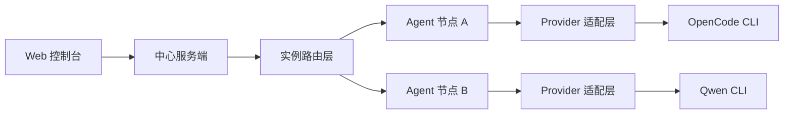

# 多 Agent 多 CLI 统一架构设计

## 1. 架构目标

- 本地与远程统一走 Agent 模型
- 用户先选择 Agent，再拉取该 Agent 所属会话
- 中心服务仅负责控制面与编排
- Agent 负责本机 CLI 生命周期与请求转发
- 支持多 CLI Provider，首批 OpenCode，预留 Qwen CLI
- 不考虑旧版兼容，按新项目目标直接落地

## 2. 运行时拓扑

## 3. 运行时组件划分

1. Web 控制台
- 目录 [`frontend`](frontend)
- 负责 Agent 选择、会话展示、状态反馈

2. 中心服务端
- 入口 [`backend/src/index.ts`](backend/src/index.ts:1)
- 负责鉴权、路由、审计、实例管理

3. Agent 统一接入层
- 新增目录 [`agent`](agent)
- 运行在本地与远程节点，主动作长连接接入中心服务

4. Provider 适配层
- 位于 [`agent`](agent)
- 统一抽象不同 CLI 的启动、健康、代理与能力上报

5. CLI 执行层
- 各节点本机运行 OpenCode CLI 或 Qwen CLI

6. 共享契约层
- 目录 [`shared`](shared)
- 维护跨端类型、环境配置、协议契约

7. 数据持久化层
- 目录 [`backend/src/db`](backend/src/db)
- 管理实例、令牌、能力、审计、会话归属

## 4. Agent 嵌入式适配器方案

采用方案 B 嵌入式适配器。

模块建议
- `connection-client`
  - 注册实例
  - 维持长连接
  - 心跳与重连
- `process-manager`
  - 启动停止重启 CLI
  - 健康探测与版本检查
- `http-bridge`
  - 转发中心请求到本机 CLI
  - 支持流式返回
- `provider-registry`
  - provider 注册与选择
  - 能力声明聚合
- `capability-reporter`
  - 上报 MCP、Skill、会话能力与健康状态

## 5. 多 CLI Provider 抽象

统一 Provider 接口字段
- `id`
- `kind`
- `start`
- `stop`
- `health`
- `version`
- `proxy`
- `capabilities`

能力维度
- chat
- session
- mcp
- skill
- streaming
- file_ops

## 6. 中心服务端关键改造

- 将 [`/api/opencode/*`](backend/src/index.ts:275) 升级为按 `instanceId` 路由
- 将单目标代理逻辑从 [`proxyRequest()`](backend/src/services/proxy.ts:95) 改为实例通道转发
- 所有会话模型强制绑定 `instanceId`
- 将本地直连逻辑从 [`OpenCodeServerManager`](backend/src/services/opencode-single-server.ts:29) 移出中心服务

## 7. 安全与治理

- Agent 到中心服务全链路 TLS
- 实例级 token 鉴权，支持轮换与吊销
- 用户与实例权限绑定
- 跨实例访问全量审计

## 8. 实施原则

- 不考虑旧版兼容，直接按统一 Agent 架构实现
- 中心服务不保留本机 CLI 直连路径
- 所有会话与代理能力从首版起强制绑定 `instanceId`
